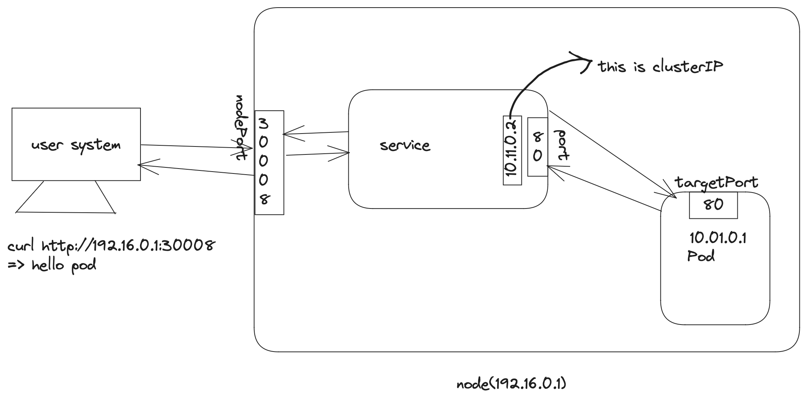

Services enable communication between various components within and outside of the application.

1. NodePort
    Nodeports are vaild only between 30000 - 32767
    here it will use the random algorithm and session affinity=yes to route the traffic to different pods in the node.
2. ClusterIP
    In the real world application we have number of application instance running for seamless operations. For an application we have different types of tiers running always and for each tier we have number of pods running. we cannot communicate with the pods directly as their IP address is not static. So to make the communication effective we will create a service and group all the same tier pods under that. The service will then randomly select and divert the traffic to the pods in the cluster. This kind of service is called ClusterIP.
3. Loadbalancer
     This service is useful when we use the cloud providers native load balancers. If we use this service in the VM kind environment then it will just work like a nodePort service.
